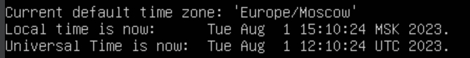
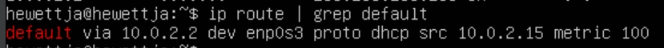
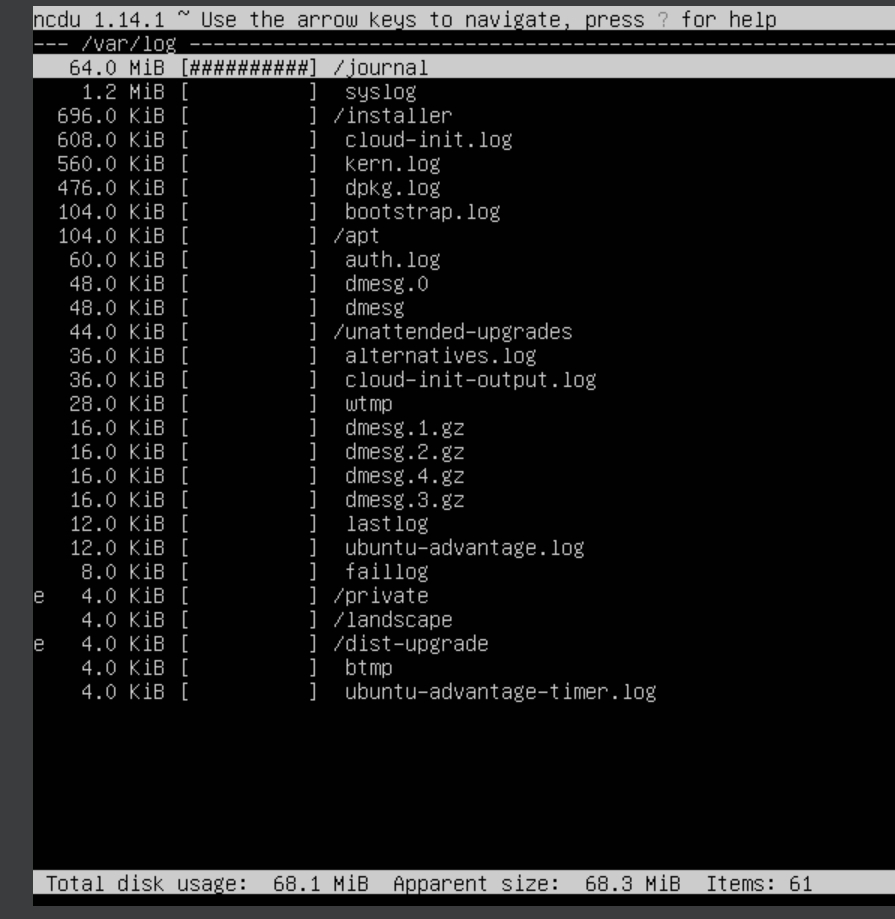

# Part 1:  
  

# Part 2:  
  
  
  

# Part 3:
  
sudo dpkg-reconfigure tzdata  
  
In the report give an explanation for the presence of the lo interface: 
  
lo - виртуальный интерфейс, используется для отладки сетевых программ и запуска серверных приложений на локальной машине. С этим интерфейсом всегда связан адрес 127.0.0.1. У него есть dns-имя – localhost. Любой трафик, который посылается компьютерной программой на интерфейс loopback, тут же получается тем же интерфейсом. Он всегда доступен, независимо от состояния физических сетевых интерфейсов.  
  
DHCP назначает свободные IP-адреса для девайсов, отправляющих запрос на использование сети.
inet 10.0.2.15/24 brd 10.0.2.255 scope global dynamic enp0s3 - DHCP выделил адрес 10.0.2.15 для enp0s3.  
valid_lft 85101sec preferred_lft 85101sec - адрес валиден 85101 секунд.
  
Internal: 10.0.2.2  
External: 10.0.2.15  
  
  
  
# Part 4:
  
# Part 5:
sudo нужно для выполнения команд от суперпользователя root (повышение привилегий), либо других пользователей.
  
# Part 6:
  
# Part 7:
Vim: 
1) vim test_vim.txt
2) i
3) hewettja
4) esc
5) wq + enter  
  

Nano:
1) nano test_nano.txt
2) hewettja
3) Ctrl+O
4) Enter
5) Ctrl+X  
  

MCEDIT:
1) mcedit test_mcedit.txt
2) hewettja
3) f2 + enter
4) f10  
  
  

Vim:
1) shift + S
2) 21 School 21
3) esc
4) q! + enter  
  

Nano:
1) ctrl + \
2) hewettja
3) 21 School 21
4) y + enter
5) Ctrl+X
6) N+enter  
  

MCEDIT:
1) f4
2) hewettja + tab + 21 School 21
3) enter
4) f10
5) no  

Search:

  
  
  
  
  
  
  
  
  
  
  
  
  
  

# Part 8:

1)  - sudo apt update 
    - sudo apt install openssh-server
2) - sudo systemctl enable ssh
   - sudo systemctl start ssh
3) - sudo vim /etc/ssh/sshd_config
    - /Port enter
    - Port 2022
    - service sshd restart
4) - ps -ef | grep sshd
5) - sudo reboot

  
ps : показывает процессы, -e выбирает все процессы, -f детальная информация
  
-t: показывает tcp соединения, -a показывает активные и ожидающие соединения, включая слушающие порты, -n показывает адреса как числа

tcp: протокол соединения 
0 и 0: очереди получения и отправки данных на сокет 
0.0.0.0:2022: адрес и порт сервера 
0.0.0.0:*: адрес и порт клиента, * - любой порт 
LISTEN - состояние соединения, сервер "слушает" на указанном порту и ожидает входящих соединений

# Part 9:
  
top:
- uptime: 56 mins
- number of authorised users: 1
- total system load: 0.03
- total number of processes: 104
- cpu load: 0.0 user, 0.2 system, 0.0 nice, 99.8 idle, 0.0 I/O wait, 0.0 hardware interrupts, 0.0 soft. interrupts, 0.0 stolen time
- memory load: 159.1 используется процессами, 402.4 используется для кэша
- pid of the process with the highest memory usage: 677
  
- pid of the process taking the most CPU time: 1197

htop:
  
  
  
  
  
  
  

# Part 10:

/dev/sda: 25 GiB, 52428800 sectors, 2GiB swap size

# Part 11:

  
- partion size: 11758760
- space used: 4821296
- space free: 6318356
- percentage used: 44%
- measurement unit: 1024 бита

  
- partion size: 12G
- space used: 4.6G
- space free: 6.1G
- percentage used: 44%
- file system type: ext4

# Part 12:

  
  

# Part 13:

  
  
  
  
  
  

# Part 14:

  
17:53:29, hewettja, LOGIN
  

# Part 15:

  
  
  
  
